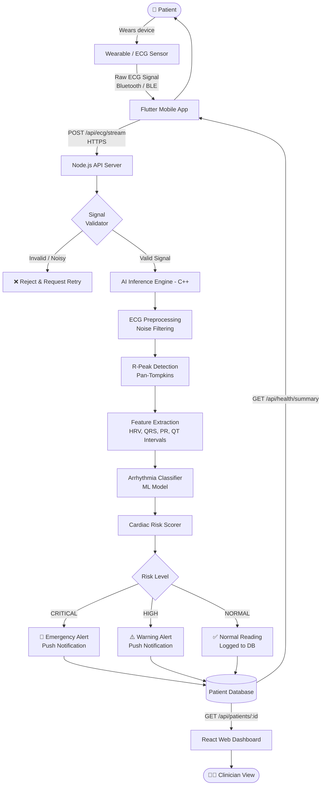

<div align="center">


# 🫀 CardioSense AI

### AI-Powered Cardiovascular Health Monitoring System

[](https://react.dev)
[](https://flutter.dev)
[](https://nodejs.org)
[](https://vitejs.dev)
[](LICENSE)

> Real-time ECG analysis · Arrhythmia detection · Personalized cardiac risk assessment

</div>

---

## 📋 Table of Contents

- [Overview](#-overview)
- [Key Features](#-key-features)
- [System Architecture](#-system-architecture)
- [Data Flow Diagram](#-data-flow-diagram)
- [Tech Stack](#-tech-stack)
- [Project Structure](#-project-structure)
- [Getting Started](#-getting-started)
- [API Reference](#-api-reference)
- [Contributing](#-contributing)

---

## 🌟 Overview

**CardioSense AI** is a full-stack, AI-powered cardiovascular health monitoring platform designed to provide continuous, real-time insights into a user's cardiac health. The system combines a **Flutter mobile app** for data collection and patient interaction, a **React web dashboard** for clinician/admin views, and a **Node.js backend** with embedded AI models for ECG signal processing, arrhythmia classification, and risk scoring.

CardioSense bridges the gap between wearable health devices and actionable medical intelligence — empowering both patients and healthcare providers with timely, accurate cardiac analytics.

---

## ✨ Key Features

| Feature | Description |
|---|---|
| 🔴 **Real-Time ECG Analysis** | Continuous monitoring and visualization of electrocardiogram signals from connected wearables |
| ⚡ **Arrhythmia Detection** | AI-driven classification of cardiac irregularities including AFib, tachycardia, bradycardia, and PVCs |
| 📊 **Cardiac Risk Assessment** | Personalized risk scoring based on ECG patterns, historical data, and patient profile |
| 📱 **Mobile App (Flutter)** | Cross-platform iOS/Android app for patients to monitor vitals and receive alerts |
| 🖥️ **Web Dashboard (React)** | Clinician-facing dashboard for reviewing patient data, trends, and alerts |
| 🔔 **Smart Alerts** | Automated notifications for critical cardiac events requiring immediate attention |
| 🔒 **Secure Health Data** | HIPAA-aware data handling with encrypted transmission and storage |

---

## 🏗️ System Architecture

The system is built on a **three-tier architecture** comprising a mobile/web presentation layer, a RESTful Node.js backend, and an AI inference engine.

```
┌─────────────────────────────────────────────────────────────────┐
│                        PRESENTATION LAYER                       │
│                                                                 │
│   ┌─────────────────────┐        ┌─────────────────────────┐   │
│   │   Flutter Mobile    │        │   React Web Dashboard   │   │
│   │   (iOS & Android)   │        │   (Vite + React 19)     │   │
│   │                     │        │                         │   │
│   │  • ECG Viewer       │        │  • Patient Overview     │   │
│   │  • Health Alerts    │        │  • Analytics Charts     │   │
│   │  • Risk Dashboard   │        │  • Alert Management     │   │
│   │  • Profile Manager  │        │  • Report Generation    │   │
│   └──────────┬──────────┘        └──────────┬──────────────┘   │
└──────────────┼────────────────────────────────┼─────────────────┘
               │           HTTPS / REST API     │
               └──────────────┬─────────────────┘
                              │
┌─────────────────────────────▼───────────────────────────────────┐
│                         APPLICATION LAYER                        │
│                                                                  │
│   ┌───────────────────────────────────────────────────────────┐ │
│   │                   Node.js Backend (Express)               │ │
│   │                                                           │ │
│   │   ┌────────────┐  ┌────────────┐  ┌────────────────────┐ │ │
│   │   │ Auth &     │  │ ECG Signal │  │  Patient Data &    │ │ │
│   │   │ User Mgmt  │  │ Ingestion  │  │  Records API       │ │ │
│   │   └────────────┘  └─────┬──────┘  └────────────────────┘ │ │
│   │                         │                                  │ │
│   │   ┌─────────────────────▼───────────────────────────────┐ │ │
│   │   │              AI Inference Engine (C++)               │ │ │
│   │   │                                                      │ │ │
│   │   │   • ECG Preprocessing & Noise Filtering              │ │ │
│   │   │   • R-Peak Detection (Pan-Tompkins Algorithm)        │ │ │
│   │   │   • Arrhythmia Classifier (ML Model)                 │ │ │
│   │   │   • Cardiac Risk Scorer                              │ │ │
│   │   └──────────────────────────────────────────────────────┘ │ │
│   └───────────────────────────────────────────────────────────┘ │
└─────────────────────────────┬───────────────────────────────────┘
                              │
┌─────────────────────────────▼───────────────────────────────────┐
│                           DATA LAYER                             │
│                                                                  │
│        ┌──────────────┐          ┌──────────────────────┐       │
│        │  Patient DB  │          │  ECG Time-Series DB  │       │
│        │  (User Data, │          │  (Raw signals,       │       │
│        │   Profiles)  │          │   Analysis Results)  │       │
│        └──────────────┘          └──────────────────────┘       │
└──────────────────────────────────────────────────────────────────┘
```

---

## 🔄 Data Flow Diagram

The following diagram shows how ECG data travels from the wearable device through the system to generate a health insight for the user.



---

## 🧠 AI Model Pipeline

```
Raw ECG Signal (mV over time)
         │
         ▼
┌─────────────────────┐
│   Bandpass Filter   │  Remove baseline wander & high-freq noise
│   (0.5 – 40 Hz)     │
└─────────┬───────────┘
          │
          ▼
┌─────────────────────┐
│  Derivative Filter  │  Amplify QRS slopes
└─────────┬───────────┘
          │
          ▼
┌─────────────────────┐
│  Squaring Function  │  Make all values positive
└─────────┬───────────┘
          │
          ▼
┌─────────────────────┐
│  Moving Window      │  Integrate signal energy
│  Integration        │
└─────────┬───────────┘
          │
          ▼
┌─────────────────────┐
│  Thresholding &     │  Locate R-peaks (heartbeats)
│  R-Peak Detection   │
└─────────┬───────────┘
          │
          ▼
┌─────────────────────────────────────────┐
│         Feature Vector Extraction       │
│  • RR Intervals  • HRV Metrics          │
│  • QRS Duration  • P & T wave presence  │
│  • PR Interval   • ST Segment deviation │
└─────────────────┬───────────────────────┘
                  │
                  ▼
┌─────────────────────────────────────────┐
│        Arrhythmia Classifier (ML)       │
│                                         │
│  Classes:                               │
│   N  → Normal Sinus Rhythm              │
│   A  → Atrial Fibrillation (AFib)       │
│   V  → Ventricular Arrhythmia           │
│   S  → Supraventricular Ectopic         │
│   F  → Fusion Beat                      │
└─────────────────┬───────────────────────┘
                  │
                  ▼
┌─────────────────────────────────────────┐
│          Cardiac Risk Score             │
│                                         │
│  0–30   → Low Risk    ✅                │
│  31–60  → Moderate    ⚠️               │
│  61–85  → High Risk   🔶               │
│  86–100 → Critical    🚨               │
└─────────────────────────────────────────┘
```

---

## 🛠️ Tech Stack

### Frontend — Web Dashboard
| Technology | Purpose |
|---|---|
| React 19 | UI framework |
| Vite 8 | Build tool & dev server |
| React Router v7 | Client-side routing |
| Lucide React | Icon library |
| CSS Modules | Component styling |

### Mobile App
| Technology | Purpose |
|---|---|
| Flutter | Cross-platform mobile framework |
| Dart | Application language |
| BLE Packages | Wearable device communication |

### Backend
| Technology | Purpose |
|---|---|
| Node.js + Express | REST API server |
| C++ | High-performance AI inference engine |
| CMake | C++ build system |

---

## 📁 Project Structure

```
Cardiosense-AI/
│
├── 📂 src/                         # React web dashboard source
│   ├── components/                 # Reusable UI components
│   ├── pages/                      # Route-level page components
│   ├── hooks/                      # Custom React hooks
│   └── utils/                      # Helper utilities
│
├── 📂 backend/                     # Node.js API server
│   ├── routes/                     # API route handlers
│   ├── controllers/                # Business logic
│   ├── models/                     # Data models / schemas
│   ├── middleware/                 # Auth, validation, logging
│   └── ai/                         # AI inference engine (C++)
│
├── 📂 cardiosense_mobile/          # Flutter mobile application
│   ├── lib/
│   │   ├── screens/                # App screens
│   │   ├── widgets/                # Flutter widgets
│   │   ├── services/               # API & BLE services
│   │   └── models/                 # Data models
│   ├── android/                    # Android-specific configs
│   └── ios/                        # iOS-specific configs
│
├── 📂 public/                      # Static web assets
├── index.html                      # Web entry point
├── vite.config.js                  # Vite configuration
├── package.json                    # Node dependencies (web)
└── README.md                       # This file
```

---

## 🚀 Getting Started

### Prerequisites

- **Node.js** ≥ 18.x
- **npm** ≥ 9.x
- **Flutter SDK** ≥ 3.x
- **Dart SDK** ≥ 3.x
- **CMake** ≥ 3.x (for C++ AI engine)

---

### 1. Clone the Repository

```bash
git clone https://github.com/Hiruniathukorala/Cardiosense-AI.git
cd Cardiosense-AI
```

---

### 2. Start the Web Dashboard

```bash
# Install dependencies
npm install

# Run development server
npm run dev
```

The web dashboard will be available at `http://localhost:5173`

---

### 3. Start the Backend API

```bash
cd backend
npm install

# Start backend on port 5001
npm start
# OR from root:
npm run backend
```

The API server will be available at `http://localhost:5001`

---

### 4. Run the Flutter Mobile App

```bash
cd cardiosense_mobile

# Get Flutter dependencies
flutter pub get

# Run on a connected device or emulator
flutter run
```

---

## 📡 API Reference

### ECG Endpoints

| Method | Endpoint | Description |
|---|---|---|
| `POST` | `/api/ecg/stream` | Ingest raw ECG signal data |
| `GET` | `/api/ecg/:patientId/history` | Retrieve ECG history for a patient |
| `GET` | `/api/ecg/:recordId/analysis` | Get AI analysis for a specific ECG record |

### Patient Endpoints

| Method | Endpoint | Description |
|---|---|---|
| `GET` | `/api/patients` | List all patients |
| `GET` | `/api/patients/:id` | Get patient profile |
| `PUT` | `/api/patients/:id` | Update patient data |

### Health Summary Endpoints

| Method | Endpoint | Description |
|---|---|---|
| `GET` | `/api/health/summary/:patientId` | Get overall health summary |
| `GET` | `/api/health/risk/:patientId` | Get current cardiac risk score |
| `GET` | `/api/alerts/:patientId` | Get alerts for a patient |

---

## 🤝 Contributing

Contributions are welcome! Please follow these steps:

1. **Fork** this repository
2. **Create** your feature branch: `git checkout -b feature/AmazingFeature`
3. **Commit** your changes: `git commit -m 'Add AmazingFeature'`
4. **Push** to the branch: `git push origin feature/AmazingFeature`
5. **Open** a Pull Request

Please make sure your code follows the existing style and includes appropriate tests.

---

## ⚠️ Disclaimer

CardioSense AI is intended as a health monitoring and informational tool only. It is **not a substitute for professional medical advice, diagnosis, or treatment**. Always consult a qualified healthcare provider for any cardiac-related concerns.

---

<div align="center">

Made with ❤️ by [Hiruniathukorala](https://github.com/Hiruniathukorala)

</div>
